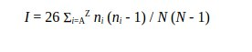
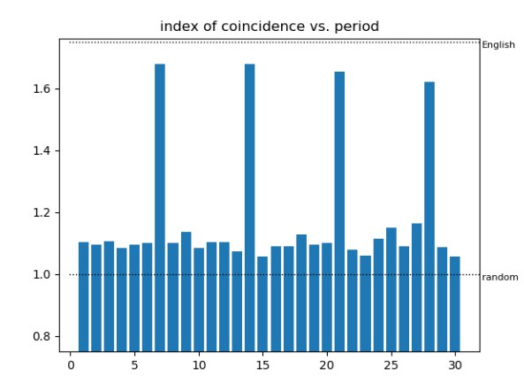

# 1 Basic information
## 1.1 What is this project about?
This project is a tool to crack some cyphertext, encrypted by Vigenere cypher. It contains the necessary source code to build executable file and test suite. 
Based on https://www.cipherchallenge.org/wp-content/uploads/2020/12/Five-ways-to-crack-a-Vigenere-cipher.pdf article.
## 1.2 Vigenere cypher
The Vigenère cipher is a periodic polyalphabetic substitution cipher. The key is a string of characters.
To explain how the cipher works, let's first replace the characters of the key and the characters of the
plaintext by integers, where A=0, B=1, ..., Z=25. The length of the key let's call the period or L. So the
key is just a set of numbers k[0], k[1], ..., k[L-1]. Next take the plaintext and express it also as a list of
numbers: p[0], p[1], p[2], ... The text is encrypted by adding a number from the key modulo 26 to a number
from the plaintext, where we run through the key over and over again as needed as we run through the
plaintext. As an equation, the [i]th character is encrypted like this:
c[i] = (p[i] + k[i mod L]) mod 26
## 1.3 Assumptions
For this project, we assume, that maximum length of encryption key is 12. Also, we assume that plaintext is a string of characters in a lower case with no spaces, quotes, numbers or special characters. And the last - plaintext is some text, written in English. 
# 2 Necessary theory
## 2.1 Frequency tables 
The present method of breaking Vigenere cypher is called **variational method** and it requires information about letter frequencies in natural languages (English in our case) i.e. how often such a letter can be found in some text. To be more precise - we need information about tetragrams (combination of four-letter sequences) frequencies. My source for that is http://practicalcryptography.com/cryptanalysis/letter-frequencies-various-languages/english-letter-frequencies/ and file english_quadgrams.txt. This method is based on the fact that one tetragram in English is more common than another. We'll discuss later how it can be used.
## 2.2 Fitness
Fitness is a way to quantify how closely a piece of text resembles English text. One way to do this is to
compare the frequencies of tetragrams in the text with the frequency table that we built in the last
section. It turns out that throwing in a logarithm helps, too. The basic idea is to start with zero and add
the log of the value from our table for each tetragram that we find in the text that we are evaluating,
then divide by the number of tetragrams to get an average. The average is more useful than the total
because it allows our programs to make decisions independent of the length of the text. Defined in this
way, the fitness of English texts is typically around -9.6.
### pseudocode:
```
def fitness(text):
  result = 0
  for i in range(len(text)-3):
    tetragram = text[i:i+4]
    x = (ALPHABET.index(tetragram[0])*26*26*26 +
          ALPHABET.index(tetragram[1])*26*26 +
          ALPHABET.index(tetragram[2])*26 +
          ALPHABET.index(tetragram[3]))
    y = tetrafrequencies[x]
    if y == 0:
      result += -15 # some large negative number
    else:
      result += log(y)
  result = result / (len(text) - 3)
  return result
```
## 2.3 Finding the period (keylength): index of coincidence
The index of coincidence (IoC) measures the likelihood that any two characters of a text are the same.
A concise formula for the IoC is


where n[i] are the counts of the letters in the text, and N is the total number of characters. Notice that we
used a normalization factor of 26 which does not appear in Friedman's original definition. With this
normalization, a random text has an IoC close to 1, while English text is close to 1.7.
To use the IoC to find the period of the cipher, we cut the ciphertext into m slices, where each slice
contains every mth letter. Then we find the IoC for each slice and average them. We do this for various
choices of m. The smallest m with an average IoC close to 1.7 is our period. For example, here we see
the IoC versus the number of slices m. The period for this example is 7.


Now, we can find the length of key.
### Pseudocode:
```
def index_of_coincidence(text):
  counts = [0]*26
  for char in text:
    counts[ALPHABET.index(char)] += 1
  numer = 0
  total = 0
  for i in range(26):
    numer += counts[i]*(counts[i]-1)
    total += counts[i]
  return 26*numer / (total*(total-1))

found = False
period = 0
while not found:
  period += 1
  slices = ['']*period
  for i in range(len(ciphertext)):
    slices[i%period] += ciphertext[i]
  sum = 0
  for i in range(period):
    sum += index_of_coincidence(slices[i])
  ioc = sum / period
  if ioc > 1.6:
    found = True
```
## 2.4 Evaluation whether the text consists of English words
In case when the cyphertext is very short (13 - 30 letters) IoC method is not enough to evaluate if the text consists of English words. So, 
let's discuss the dictionary method to evaluate it. 

This method needs the dictionary of English words. The source is http://www.mieliestronk.com/corncob_lowercase.txt

The method is simple: we iterate over whole dictionary and looking for every entry of current word in the text. We mark every letter in each such substring as a part of some word, even for overlapping cases. In the end, we divide the count of "marked" letters to total letters count. If the rate is more than 0.95 - we assume that the text is consists of English words.
### Pseudocode:
```
def check_if_words (str):
  ret = False;
  charmap = [False]*str.length()
  counter = 0;
  cur_pos = 0;

  for word in dict:
    while ((found_pos = find_substr_in_str (str, word)) != -1):
      for i in range (word.length ()):
        if false == charmap[found_pos + i]:
          charmap[cur_pos + i] = true;
          counter++;
	if (counter / str.length () > 0.95)
		ret = true;
	return ret;
```
### Ideas to improve it
Despite this method makes less false-positives and false-negatives than IoC method for very small texts, it still makes mistakes comparely often. 
Maybe, there is a way to use "knapsack problem" solution to make such evaluation more precise

# 3 Cracking methods
## 3.1 Variational method
Here is a variational method that works even for comparely short ciphertexts. For each letter of the key, we vary
it and choose the option that gives the best fitness of the decrypted text. It loops over all the letters of
the key many times and chooses the best key candidate in the end. Here is some pseudocode to illustrate the method:
```
from random import randrange
key = ['A']*period
fit = -99 # some large negative number
for i in range (1000 * keylen):
  K = key[:]
  x = randrange(period)
  for i in range(26):
    K[x] = ALPHABET[i]
    pt = decrypt(ciphertext,K)
    F = fitness(pt)
    if (F > fit):
      key = K[:]
      fit = F
plaintext = decrypt(ciphertext,key)
check_if_words (plaintext)
```
## 3.2 Dictionary-based variational method
Despite the previous method is really powerful, it doesn't able to crack extra small cyphertext (for example, when cyphertext is covered by key less than 5 times), or even guess the keylen. So, if our target is some REALLY SMALL cyphertext and we have a few extra hours - we can try to use this method. 

So, the idea is based on fact, that cyphertext is a sequence of encrypted words in English. We can randomly choose some index in cyphertext and assume that this index is a start of some word in English. Next, iterate over every word in our dictionary, and mutate the tested key according to our assumption. Decrypt cyphertext using tested key and change the best key candidate if the fitness is greater than previous best fitness. Repeat many times.

Or more simple: It loops over all the letters of the key many times and chooses the best key candidate in the end by analogy with the previous method, but this method mutates the key in more aggressive way every iteration.
### pseudocode:
```
from random import randrange
key = ['A']*period
fit = -99 # some large negative number
for i in range (1000):
  x = randrange(period)
  for word in dict:
    K = key[:]
    reversed_key = get_key_from_word(ciphertext, word, x)
    insert_reversed_key (K, reversed_key)
    pt = decrypt(ciphertext,K)
    F = fitness(pt)
    if (F > fit):
      key = K[:]
      fit = F
plaintext = decrypt(ciphertext,key)
check_if_words (plaintext)
```
### What to improve there
Despite the fact that this method is more powerful than the previous one, unfortunately, it is still not bulletproof and makes mistakes comparely often. One of the easy ways to reduce False Negatives - is to save some number of key candidates instead of saving a single one "best" candidate. Also, if the text is very small - there is a big chance to got a False Positive - when plaintext candidate  was assumed as an English words text, but it is not. This problem should be solved by "check_if_words" function improving.

Also, since this method is really slow, we should find the way to optimize it. For example, make parallel calculations on different CPU cores.

# 4 Program usage
## 4.1 Compilations and make targets
Simple compilation:
```
cd src
make
```
Debug compilation:
```
cd src
make debug
```
These targets compile executable file and move it to `<PROJECT_ROOT>/bin/` directory

Clean binary:
```
cd src
make clean
```
Launch tests:
```
cd src
make test
```
## 4.2 Encryption
Create some file:
```
echo "File with some strange text" > file_to_encrypt
```
and encrypt it using `-e` option:
```
bin/vigenere -e file_to_encrypt > encrypted_file
```
The program will ask you to enter the cypher key. Next, it will format it to standard way (only letters in lower case), encrypt and print to `encrypted_file` file
## 4.3 Decryption
The only way to decrypt the file in this program is to crack it. 
Run decryption using `-d` option:
```
bin/vigenere -d encrypted_file
```
This option will launch the cracking sequence. If the cyphertext is long enough, it will crack it by variational method in a few seconds. Otherwise, it will use Dictionary-based variational method. Be ready to wait for a few hours here :)
The output is plaintext + key in the next line
## 4.4 Verbose mode
There is an option to track the current status of execution. Just export "VERBOSE=1" env. variable:
```
export VERBOSE=1
```
If this variable is exported, the program prints found plaintext candidates and the current percentage of execution time to stderr.
## 4.5 Tests
There s a test suite with some test cases and a simple test script. Just execute
```
cd src
make test
```
and track tests execution. Please, pay attention that "short text" test cases are executing very slowly.
